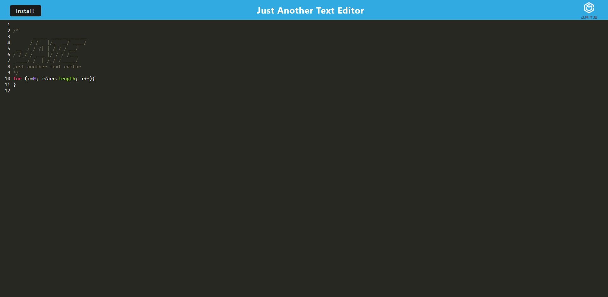

# JATE

## Description

This project was built to explore the capabilities of PWAs. In this project, we were given starter code and had to add the plugins, loaders, the install functionality and the IndexDB. Through this project, I learned how to work with IndexDB, how to work with window.prompts, and how caching works. The IndexDb was the hardest part of this project, as some things must be written differently for codemirror.

## Installation

To use this project locally, the following must be installed, "concurrently", "nodemon", "express", "babel-loader", "css-loader", "html-webpack-plugin", "webpack", "webpack-cli", "webpack-dev-server", "webpack-pwa-manifest" "workbox-web-pack-plugin", "code-mirror", and "idb".

## Usage

To use this project, simply write in the code editor, when the editor loses focus, the changes will be saved to IndexDB. On load the information will be pulled from the database. The site caches data and will still appear offline. Click the install button to install the app. If the app is already installed the button will not work. When the app is installed, you will be able to open it from the desktop.

[Website](https://floating-meadow-32660.herokuapp.com/)

## Credits

N/A

## How to Contribute

For questions and contributions, you can reach me here:
[Email](mailto:bielinskilucas@gmail.com)
or
[Github](https://github.com/LucasBielinski)

